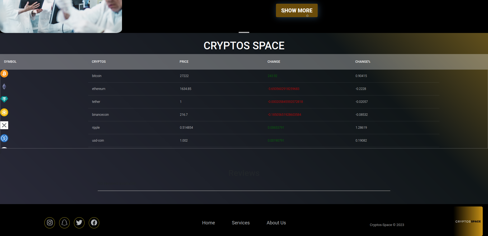
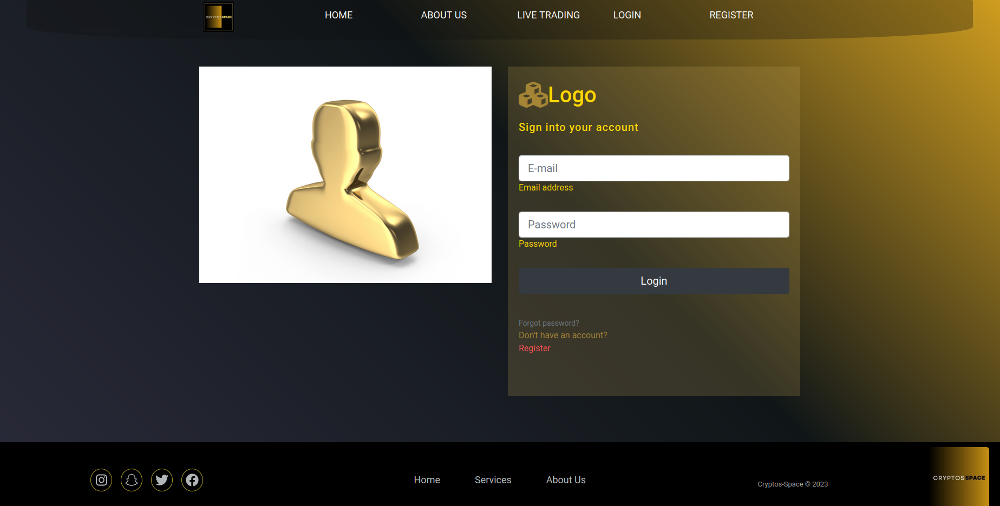
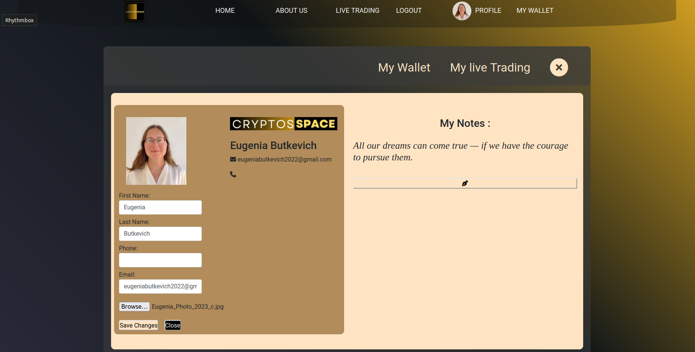
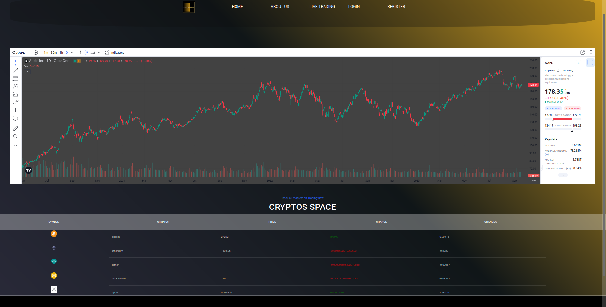

Cryptocurrency Exchange Platform [React SPA with NodeJS, Express, and MongoDB]
This application allows users to manage and track their cryptocurrency investments. It provids real-time updates on cryptocurrency prices, display the user's wallet balance, and offer various features to analyze and track their investments. Live at https://cryptos-client-j1do.onrender.com/

